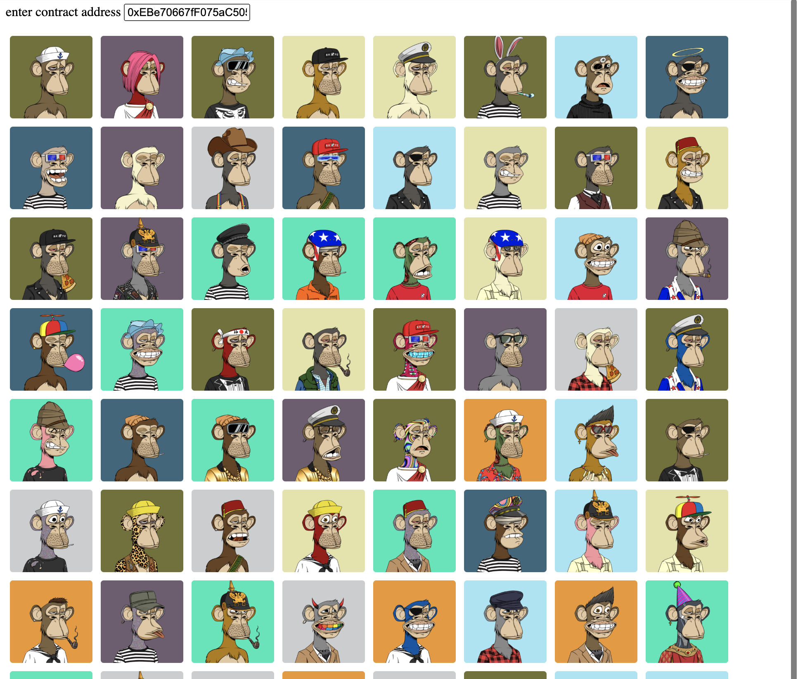
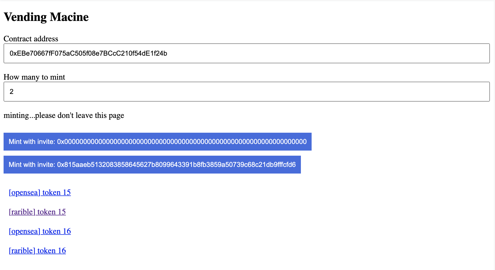

# factoria decentralized API

Once you publish your collection, Factoria stores and loads everything from IPFS and Ethereum.

This means you can **build your own custom READ/WRITE web interface** to interact with your entire NFT collection.

NO SERVER. NO CLOUD. JUST IPFS and ETHEREUM.

And only use JavaScript to build your entire NFT collection web app.

---

# support

- Looking for user documentation? (not dev docs): https://docs.factoria.app/
- Join Discord and ask questions: https://discord.gg/BZtp5F6QQM
- Follow on Twitter to get updates: https://twitter.com/skogard

---

# quickstart

> **NOTE**
>
> ALL examples in this documentation use the testnet (Rinkeby).
>
> To follow along, sign in to Rinkeby wallet before trying the demos.
>
> To try with your OWN collection, set up a testnet collection at https://testnet.factoria.app/f0


## read collection info

Let's query some basic collection info:

- `name()` => returns the name of the collection (immutable)
- `symbol()` => returns the symbol of the collection (immutable)
- `config()` => returns the current configuration for the collection
- `owner()` => returns the collection owner address
- `withdrawer()` => returns the withdrawer (if assigned by the owner)

<iframe width="100%" height="500" src="//jsfiddle.net/skogard/17dmjpwa/13/embedded/html,result/" allowfullscreen="allowfullscreen" allowpaymentrequest frameborder="0"></iframe>

Above code will print the following:

```json
{
  "name": "Fake Ape Yacht Club",
  "symbol": "FAYC",
  "config": {
    "0": "",
    "1": "ipfs://bafybeihqy4zrmiha6lt32jpqnwlqmsekgot4mttbb3li56ofbfdmxxqrsy/",
    "2": "10000",
    "3": false,
    "placeholder": "",
    "base": "ipfs://bafybeihqy4zrmiha6lt32jpqnwlqmsekgot4mttbb3li56ofbfdmxxqrsy/",
    "supply": "10000",
    "permanent": false
  },
  "owner": "0xFb7b2717F7a2a30B42e21CEf03Dd0fC76Ef761E9",
  "withdrawer": {
    "0": "0x0000000000000000000000000000000000000000",
    "1": false,
    "account": "0x0000000000000000000000000000000000000000",
    "permanent": false
  }
}
```

---

## read tokens

### basic

Fetching NFT data involves 2 steps:

1. Get the tokenURI for each token
2. Fetch the tokenURI to get the metadata JSON object

<iframe width="100%" height="900" src="//jsfiddle.net/skogard/s9poqdur/31/embedded/html,result/" allowfullscreen="allowfullscreen" allowpaymentrequest frameborder="0"></iframe>

Using the above method, you can get **NFT metadata** for any `tokenId` on your collection.

But let's imagine a scenario where you want to display ALL your NFT 10,000 items for your collection. You will need to:

1. First make 10,000 requests to get the tokenURI
2. Then, fetch that tokenURI to get the actual metadata

This will become very inefficient to run because you need to make 10,000 requests **just to get the tokenURI**, and then you make an additional request for each `tokenURI` to get the actual metadata.

What if you could get rid of the first step?  Fortunately, you can. See the next section.

### recommended

Factoria's collection contract has a predictable URI scheme. Each metadata has a `tokenURI` that looks something like this:

```
ipfs://bafybeihleczomdfdxahe2jnr26ssgko4jnpn3my2utqf4ja52dhp7g5z7m/1.json
ipfs://bafybeihleczomdfdxahe2jnr26ssgko4jnpn3my2utqf4ja52dhp7g5z7m/2.json
ipfs://bafybeihleczomdfdxahe2jnr26ssgko4jnpn3my2utqf4ja52dhp7g5z7m/3.json
ipfs://bafybeihleczomdfdxahe2jnr26ssgko4jnpn3my2utqf4ja52dhp7g5z7m/4.json
ipfs://bafybeihleczomdfdxahe2jnr26ssgko4jnpn3my2utqf4ja52dhp7g5z7m/5.json
ipfs://bafybeihleczomdfdxahe2jnr26ssgko4jnpn3my2utqf4ja52dhp7g5z7m/6.json
ipfs://bafybeihleczomdfdxahe2jnr26ssgko4jnpn3my2utqf4ja52dhp7g5z7m/7.json
ipfs://bafybeihleczomdfdxahe2jnr26ssgko4jnpn3my2utqf4ja52dhp7g5z7m/8.json
ipfs://bafybeihleczomdfdxahe2jnr26ssgko4jnpn3my2utqf4ja52dhp7g5z7m/9.json
ipfs://bafybeihleczomdfdxahe2jnr26ssgko4jnpn3my2utqf4ja52dhp7g5z7m/10.json
...
```

Which is:

```
ipfs://<metadata folder cid>/<tokenId>.json
```

Note that the folder name does not change. It's only the filename that changes according to the `tokenId`. 

This means, once we know the **folder name**, we know the `tokenURI` of every single token in the collection automatically, and **do not need to make `tokenURI(tokenId)` requests using Web3 all the time.

The **folder name** is stored inside the `config` object as `base` attribute (meaning "base uri"), which you can get through the `config()` method. Here's an example:


<iframe width="100%" height="1300" src="//jsfiddle.net/skogard/d9a3vh5o/11/embedded/html,result/" allowfullscreen="allowfullscreen" allowpaymentrequest frameborder="0"></iframe>

Note that we have commented out the `getTokenURI()` method and instead directly **compute** the tokenURI without making a request to Ethereum:

```javascript
const config = await this.collection.methods.config().call()
const tokenURI = config.base + tokenId + ".json"
```

The `config` object contains an attribute named `base`, which is the IPFS folder URI, so you just need to append the `tokenId` and `.json` to get the tokenURI.

This time let's try rendering the collection from tokenId 1 to 100. The demo below will look something like this:




<iframe width="100%" height="1300" src="//jsfiddle.net/skogard/4g2myjs1/7/embedded/html,result/" allowfullscreen="allowfullscreen" allowpaymentrequest frameborder="0"></iframe>

---

## basic vending machine

Let's start with the simplest vending machine: A vending machine that lets people mint from a collection that has already launched publicly.

Every release on Factoria is carried out through "Invites". Even a public one.

And a "public launch" is nothing more than creating an invite with a null Invite key `0x0000000000000000000000000000000000000000000000000000000000000000`:.

```
{
  key: "0x0000000000000000000000000000000000000000000000000000000000000000",
  proof: []
}
```

Note that the `proof` is an empty array because it's public and you don't need a proof.

<iframe width="100%" height="1000" src="//jsfiddle.net/skogard/6c01uovk/16/embedded/html,result/" allowfullscreen="allowfullscreen" allowpaymentrequest frameborder="0"></iframe>

---


## advanced vending machine

The "Basic" vending machine only lets people mint for a collection that's been launched publicly.

This was simple because we were just using the "null key" and an "empty proof", which indicated that the list is public.

But factoria provides various ways of rolling out NFTs, such as airdrop, private invite, and so on.

To support these cases, we need to learn how to fetch invites from Ethereum and IPFS, and create Proof of Invites.

> NOTE
>
> This tutorial will walk through the entire process to get you acquainted with how everything works, but if you want to just check out the final vending machine demo first, see [this section](#minting-with-private-invite)

### fetch all invite keys

To fetch all existing invite keys, we can look at the `Invited` event.

<iframe width="100%" height="600" src="//jsfiddle.net/skogard/z0x6Lr1s/11/embedded/html,result/" allowfullscreen="allowfullscreen" allowpaymentrequest frameborder="0"></iframe>

An invite key is made up of `key` and `cid`:

- `key`: the actual key that represents a list
- `cid`: the IPFS location where the list is stored

And above code will print the following result:

```json
[
  {
    "key": "0x0000000000000000000000000000000000000000000000000000000000000000",
    "cid": "0x0000000000000000000000000000000000000000000000000000000000000000"
  },
  {
    "key": "0x815aaeb5132083858645627b8099643391b8fb3859a50739c68c21db9fffcfd6",
    "cid": "0x1a14d17f408a0f85e87460a542e9fda1acee3a9d3c13091443004c88ed1a1527"
  }
]
```

This means there have been 2 invites:

1. 0x0000000000000000000000000000000000000000000000000000000000000000
2. 0x815aaeb5132083858645627b8099643391b8fb3859a50739c68c21db9fffcfd6

And the address lists for the keys are stored at the following IPFS locations:

1. 0x0000000000000000000000000000000000000000000000000000000000000000
2. 0x1a14d17f408a0f85e87460a542e9fda1acee3a9d3c13091443004c88ed1a1527

These are 32 byte digest representation of the original IPFS cid, used to efficiently store on Ethereum without wasting gas.

But we cannot directly use this format.

So let's convert these locations back to the original IPFS CID URI string so we can fetch from the IPFS URI.

### convert key to IPFS cid

We will import a JavaScript library called `ipfsh`, which has a function called `dtoc()` ("digest to cid"), which takes a byte32 digest and turns it into IPFS cid.

<iframe width="100%" height="600" src="//jsfiddle.net/skogard/6nozgphw/4/embedded/html,result/" allowfullscreen="allowfullscreen" allowpaymentrequest frameborder="0"></iframe>

On line 6, we import the `ipfsh` library:

```html
<script src="https://unpkg.com/ipfsh@0.0.1/dist/ipfsh.min.js"></script>
```

Then, on line 19, we convert the digest to string using the `dtoc()` method ("digest to cid")

```javascript
let invites = logs.map((log) => {
  return {
    key: log.returnValues.key,
    cid: ipfsh.dtoc(log.returnValues.cid)   // HERE
  }
})
```

The result looks like this:

```json
[
  {
    "key": "0x0000000000000000000000000000000000000000000000000000000000000000",
    "cid": "bafkreiaaaaaaaaaaaaaaaaaaaaaaaaaaaaaaaaaaaaaaaaaaaaaaaaaaaa"
  },
  {
    "key": "0x815aaeb5132083858645627b8099643391b8fb3859a50739c68c21db9fffcfd6",
    "cid": "bafkreia2ctix6qekb6c6q5dauvbot7nbvtxdvhj4cmeriqyajseo2gqve4"
  }
]
```

1. The first item is a "public invite" (a null invite key).
2. The second item is a private invite, which means the `key` is the merkle root and the `cid` is the location where the actual address list is stored.
3. Note that the `cid` attributes now look like a legit IPFS CID.

### fetch invite conditions

In addition to fetching the invite lists, you may also want to query the blockchain to see the actual invite conditions for the keys.

We can achieve this by calling the method:

```javascript
let inviteCondition = await collection.methods.invite(key).call()
```

<iframe width="100%" height="600" src="//jsfiddle.net/skogard/uahokevr/3/embedded/html,result/" allowfullscreen="allowfullscreen" allowpaymentrequest frameborder="0"></iframe>


### fetch invite list from IPFS

Now that we have the IPFS CID, we can query public IPFS gateways to fetch the addresses.

Let's take the second invite from the list above (`bafkreia2ctix6qekb6c6q5dauvbot7nbvtxdvhj4cmeriqyajseo2gqve4`) and fetch the address list stored on IPFS:

<iframe width="100%" height="600" src="//jsfiddle.net/skogard/Lg1zu7ek/7/embedded/html,result/" allowfullscreen="allowfullscreen" allowpaymentrequest frameborder="0"></iframe>

It will print the following:

```json
{
  "addresses": [
    "0x183e3d2ca284aa1e4a7dd8d9fae31ed850875370",
    "0x24199ff04984a465ea96d8ee07d25b46aedfaf5a",
    "0x41388c7c1acffcda2bef69a58416402e2a0a8387",
    "0x73316d4224263496201c3420b36Cdda9c0249574",
    "0x046e67f61de79b07abc3bec7c861ad12cfd04dd5",
    "0xfdc124d6ba45959ed224172fa011a6edfe48ed36",
    "0xFb7b2717F7a2a30B42e21CEf03Dd0fC76Ef761E9",
    "0xb6586a7333687619a9217c284bfa73f27be4a2f0",
    "0xb6586a7333687619a9217c284bfa73f27be4a2f0",
    "0x17e80b4e239298c4c23f5445b5017d7d91d22fe5",
    "0x7be4e36625484fd252b936be2f725777deba2dac"
  ]
}
```

### get a proof of invite

Factoria makes use of a cryptographic invite system which utilizes a technique called "merkle proof".

> **NOTE**
> 
> A naive way of doing invite lists would be to store all invited addresses on the blockchain, but that would be EXTREMELY expensive because you need to pay a lot of gas fee for each address stored. Imagine storing hundreds of thousands of addresses. This won't work.
>
> Instead of storing all addresses on chain, Factoria lets each minter submit a "proof" that they are on an invite list, which have been approved by the contract owner.

The mint function for the Factoria F0 NFT contract looks like this:

```
mint(auth, mint_count)
```

where:

- `auth`: the authentication object
  - `key`: Invite key (merkle root) to use for minting
  - `proof`: Merkle proof for the minter's address. Must be generated using the user's address and the merkle tree
- `mint_count`: how many tokens to mint from vending machine

We already have the keys from previous sections, so we just need to create a `proof`. The following example demonstrates how you can generate an invite `proof` from:

- a list of addresses (invite list)
- minter's address

<iframe width="100%" height="700" src="//jsfiddle.net/skogard/veakjcho/4/embedded/html,result/" allowfullscreen="allowfullscreen" allowpaymentrequest frameborder="0"></iframe>

It will print the following:

```json
{
  "minter_address": "0x41388c7c1acffcda2bef69a58416402e2a0a8387",
  "proof": [
    "0x22aabd46fd4e228a4ec24ca2c6b49fca6c82821ff120dc156a6298a49df9a463",
    "0xf3e78dd23204d1d678a138c7500667874b46fd6b58a1b09d380ce10cbe5c698c",
    "0xd63c1a58853f040b8210d398fa263965b3efafaaf5daccdd962cafb3e72ad269",
    "0x9dc0c758e32af0333cd8e519601ded28f746fb7854d6d48be256c7913d4911e6"
  ],
  "isvalid": true
}
```

Let's make this example more dynamic. We will build an app that takes two inputs:

1. contract address
2. account address

The app fetches all invites from the contract address, and then check to see if the account belongs to any of the lists.

If the account is on the list, it will return `invited: true` and also include a `proof`. Otherwise the `invited` will be `false` and the `proof` will be empty.

<iframe width="100%" height="1000" src="//jsfiddle.net/skogard/6k5vqgsm/43/embedded/html,result/" allowfullscreen="allowfullscreen" allowpaymentrequest frameborder="0"></iframe>

### minting with private invite

Let's combine everything together and build a vending machine that uses private invites.

Here's the demo:

<iframe width="100%" height="1000" src="//jsfiddle.net/skogard/8mcnk2eh/42/embedded/html,result/" allowfullscreen="allowfullscreen" allowpaymentrequest frameborder="0"></iframe>

Note that above demo only uses a private list so you will probably only see a public minting option with the default example.

To actually try the private invite, you can create your own Factoria contract and create some private invites.

For reference, the page should look like the following for any address that is on a private invite:




---

# ABI

<textarea>
::abi
</textarea>

---


# methods

## collection

### 1. config

```javascript
let config = await collection.methods.config().call()
```

#### parameters

> none

#### return value

```json
{
  placeholder: <string>,
  base: <string>,
  supply: <uint64>,
  permanent: <bool>
}
```

### 2. setConfig

```javascript
await collection.methods.setConfig(newConfig).send({
  from: <sender account>
})
```

#### parameters

```json
newConfig := {
  placeholder: <string>,
  base: <string>,
  supply: <uint64>,
  permanent: <bool>
}
```

#### return value

> none

### 3. setInvite

```javascript
await collection.methods.setInvite(key, cid, invite).send({
  from: <sender account>
})
```

#### parameters

There are 3 parameters:

```
key := <merkle root> | 0x0000000000000000000000000000000000000000000000000000000000000000

cid := <ipfs cid of the merkle tree>

invite := {
  price: <uint128>,
  start: <uint64>,
  limit: <uint64>
}
```

1. `key`: The invite key
    - public invite (everyone): `0x0000000000000000000000000000000000000000000000000000000000000000`
    - private invite with addresses: the merkle root of the merkle tree created from the addresses
2. `cid`: the IPFS cid that sotres the entire merkle tree for this invite list, stored in compressed bytes (not string)
2. `invite`: The actual invite configuration to associate with the invite key
    - price: the addresses on this list (or everyone if it's a public invite) can mint each token at this price.
    - start: this invite becomes valid after this start time (in unix timestamp in seconds)
    - limit: the addresses on this list (or everyone if it's a public invite) can mint tokens up to this limit.

#### return value

> none


### 4. invite

Get the invite object for an invite key

```javascript
let invite = await collection.methods.invite(key).call()
```

#### parameters

```
key := <merkle root>
```

#### return value

Returns the invite object for the key

```json
invite := {
  price: <uint128>,
  start: <uint64>,
  limit: <uint64>
}
```

> To actually get the full list of addresses tied to an invite key, you need to query the "Invited(key, cid)" event.

### 5. owner

Get the owner (admin) of this collection. An owner can:

1. withdraw funds from the contract
2. delegate withdrawer role to another account
3. log into various NFT marketplaces to manage listing and royalties, etc.
4. transfer ownership of a collection to another address

```javascript
let owner = await collection.methods.owner().call()
```

#### parameters

> none

#### return value

Returns the owner address of the collection

```
owner := <the address of the owner of this contract>
```

### 6. renounceOwnership

Throw away ownership of this collection. Can be used to provably throwaway control over this contract.

> Not really recommended. To prove renouncing of control, you can set the "permanent" attribute using the setConfig() method instead.

```javascript
await collection.methods.renounceOwnership().send({
  from: <your account (you must be the owner of the contract)>
})
```

#### parameters

> none

#### return value

> none

### 7. transferOwnership

Transfer ownership to another address.

```javascript
await collection.methods.transferOwnership(receiverAddress).send({
  from: <your account (you must be the owner of the contract)>
})
```

> NOTE
>
> When transferring ownership, you need to call `factory.addCollection(receiverAccount, collectionAddress)` first. Otherwise the contract will keep showing up on your dashboard on factoria. Factoria web UI automatically takes care of this to create 2 separate transactions.

#### parameters

```
receiverAddress := <any address>
```

#### return value

> none

### 8. setNS

Set the `name` and `symbol` attributes of a collection

```javascript
await collection.methods.setNS(name, symbol).send({
  from: <your account (you must be the owner of the contract)>
})
```

#### parameters

```
name := <new name for the collection>

symbol := <new symbol for the collection>
```

#### return value

> none

### 9. setWithdrawer

Assign a "withdrawer", someone who can withdraw funds from this contract. By default it's the owner, but once the owner assigns a new withdrawer with this function, all money goes to the withdrawer when `withdraw()` function is called.

```javascript
await collection.methods.setWithdrawer(withdrawer).send({
  from: <your account (you must be the owner of the contract)>
})
```

#### parameters

```
withdrawer := <any address>
```

#### return value

> none

### 10. withdraw

Can be called by both the owner of the contract and the withdrawer.

However the funds will go to the withdrawer regardless of who calls the function.

```javascript
await collection.methods.withdraw().send({
  from: <your account (you must be the owner or the withdrawer)>
})
```

#### parameters

> none

#### return value

> none

### 11. withdrawer

Get the current withdrawer. It's a `0x0` address by default, until the owner explicitly sets the withdrawer using `setWithdrawer()` function.

```javascript
let withdrawer = await collection.methods.withdrawer().call()
```

#### parameters

> none

#### return value

```
withdrawer := <the withdrawer's account> | 0x0 (if not set)
```

### 12. name

The default ERC721 method for getting the name of a collection

```javascript
let name = await collection.methods.name().call()
```

#### parameters

> none

#### return value

```
name := <the collection name>
```

### 13. symbol

The default ERC721 method for getting the symbol of a collection

```javascript
let name = await collection.methods.symbol().call()
```

#### parameters

> none

#### return value

```
symbol := <the collection symbol>
```

## token

### 1. mint

The F0 contract allows a vending machine approach to minting tokens (you specify the number of tokens to mint and it just gives you the tokens, instead of you minting individual tokens).


```javascript
await collection.methods.mint(auth, count).send({
  from: <your address>
})
```

#### parameters

```
auth := {
  key: <bytes32>,
  proof: [<bytes32>, <bytes32>, ...]
}

count := <the number of tokens to mint>
```

To mint using factoria F0 contract, you need to use an invite. An invite can be:

- a public invite ("anyone can mint") or
- a private invite (a merkle tree based invite list).

In both cases you need to pass the `auth` object to the `mint()` function to authenticate.

Factoria ships with a JavaScript library that lets you construct and verify merkle trees. You can learn more about it in the "Authentication" section.

#### return value

> none


### 2. gift 

The contract owner can "gift" tokens to other addresses (mint to another address) only paying the gas fee.

```javascript
await collection.methods.gift(receiver, count).send({
  from: <your address (you must be the contract owner)>
})
```

#### parameters

```
receiver := <the address of the receiving account>

count := <the number of tokens to mint and send>
```

#### return value

> none

### 3. nextId

The Factoria F0 contract is a vending machine contract. When you try to mint, the tokenId keeps incrementing (and if you need a randomization feature, it is the creator's job to randomize metadata before uploading) every time you mint.

Sometimes you may need to know how many tokens are left to mint (which you can calculate by subtracting the `nextId()` from the `config().supply`.

Or sometimes you may just want to know what the next tokenId is.

```javascript
let nextTokenId = await collection.methods.nextId().call()
```

#### parameters

> none

#### return value

```
nextTokenId := <the next tokenId to be minted if you mint now>
```

### 4. ownerOf

The default ERC721 `ownerOf()` method. Given a tokenId, get the owner of the token.

```javascript
let tokenOwner = await collection.methods.ownerOf(tokenId).call()
```

#### parameters

```
tokenId := <the tokenId>
```

#### return value

```
tokenOwner := <the address of the tokenId owner>
```

### 5. tokenURI

The default ERC721 `tokenURI()` method. Gives you the tokenURI containing the token metadata.

```javascript
let tokenURI = await collection.methods.tokenURI(tokenId).call()
```

#### parameters

```
tokenId := <the tokenId>
```

#### return value

```
tokenURI := <ipfs uri that contains the token metadata>
```

The tokenURI will look something like: `ipfs://<cid>/1.json`. To fetch this from an IPFS gateway you can do something like:

```javascript
let tokenURI = await collection.methods.tokenURI(tokenId).call()
let ipfsHash = tokenURI.replace("ipfs://", "")
let metadata = await fetch("https://ipfs.io/ipfs/" + ipfsHash).then((r) => { return r.json() })
```


### 6. burn

Burn a token. Note that "burning a token" doesn't destroy the content underneath, especially when the files are stored on IPFS.

Burning simply sends a token to a `0x0` address (which has no owner), and is used often to prove that you don't plan on selling it to anyone. (More on this here: https://twitter.com/skogard/status/1464631579448422416?s=20)

The Factoria F0 contract is designed in a flexible way so that you can even retrieve the burned tokens. While the `tokenURI()` method may give you an error when you burn a token, because of the vending machine approach where all file names are deterministic and can be computed, you can get the metadata URI of the burned tokens.

This way you can still burn a token if you really need to, while also preserving history of what it was that was burned.

```javascript
await collection.methods.burn(tokenId).send({
  from: <your address (you must be the tokenId's owner)>
})
```

#### parameters

```
tokenId := <the tokenId>
```

#### return value

> none


## tbd

- URI
- setURI
- royalty
- royaltyInfo
- setRoyalty

## ERC721 Methods

- approve
- balanceOf
- getApproved
- isApprovedForAll
- name
- symbol
- safeTransferFrom
- setApprovalForAll
- transferFrom

---

# events

## collection

### 1. Invited

```
event Invited(bytes32 indexed key, bytes32 indexed cid)
```

- **key:** the invite key
- **cid:** the IPFS CID digest (32 bytes)

#### web3

```javascript
let logs = await collection.getPastInvites("Invited", {
  fromBlock: 0,
  toBlock  : "latest",
})
```


### 2. NSUpdated

```
event NSUpdated(string name, string symbol)
```

- **name:** updated name
- **symbol:** updated symbol

#### web3

```javascript
let logs = await collection.getPastInvites("NSUpdated", {
  fromBlock: 0,
  toBlock  : "latest",
})
```


### 3. Configured

```
event Configured(Config config)
```

- **config**: the updated config where the config object looks like the following:

```json
{
  placeholder: <string>,
  base: <string>,
  supply: <uint64>,
  permanent: <bool>
}
```

#### web3

```javascript
let logs = await collection.getPastInvites("Configured", {
  fromBlock: 0,
  toBlock  : "latest",
})
```

### 4. WithdrawerUpdated

```
event WithdrawerUpdated(Withdrawer withdrawer)
```

- **withdrawer:** the withdrawer object which looks like the following:

```json
{
  account: <string>,
  permanent: <bool>
}
```

#### web3

```javascript
let logs = await collection.getPastInvites("WithdrawerUpdated", {
  fromBlock: 0,
  toBlock  : "latest",
})
```


---

